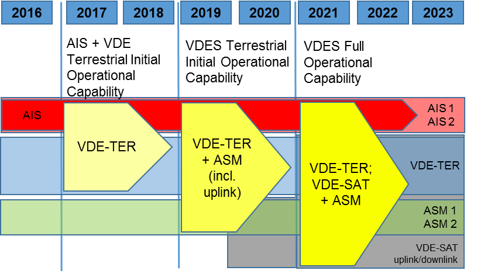

# Introduction
## Purpose of the Document
This Guideline has been prepared to provide technical information required in the development of VDES equipment, which integrates the functions of VHF data exchange (VDE), application specific messages (ASM) and the automatic identification system (AIS) in the VHF maritime mobile band (156.025-162.025 MHz).

This document refers to ITU Recommendation ITU-R M.2092-0, and is not intended to replace that document.  The IALA Guideline on Technical Specifications of VDES provides additional detail on VDES, and will be amended as required to reflect experience in implementing the technical solutions for VDES.  As this IALA Guideline is revised, input will be included, as appropriate, as a working document towards a revision of ITU-R M.2092.  It is intended that this input will be provided to the appropriate working group of ITU following the results of the ITU WRC-19.

Persons using this document are encouraged to provide comments, corrections and further input on developments to IALA.  In addition, persons who are implementing VDES are invited to participate in further work on the system through the IALA ENAV Committee.  It is noted that, as VDES develops, any deployment of VDES will need to comply with the appropriate ITU regulation, once they are agreed.

It is noted that, following WRC-15, the full satellite capability of VDES is being studied at ITU and will be reviewed at WRC-19. This IALA Guideline includes the full capability (including satellite).

## Background
AIS is well recognised and accepted as an important tool for safety of navigation and is a carriage requirement for SOLAS vessels (Class-A).  With increasing demand for maritime VHF data communications, AIS has become heavily used for maritime safety, maritime situational awareness and port security.  As a result, high loading of AIS 1 and AIS 2 created a need for additional VHF data channels.  Using the VHF marine band (International Radio Regulations Appendix 18) AIS can broadcast data to vessels in the vicinity of the AIS unit.  AIS can also transmit an addressed message.

International Telecommunications Union (ITU) has recognised the efficiency and the necessity for digital communications, has produced technical standards and has revised the VHF marine band (Radio Regulations Appendix 18) to designate channels for data transmission.  It is recognized that both analogue voice communications and digital communications will share the band.  The VDES, as envisioned by IALA and presented to ITU, addresses the identified need to protect AIS along with essential digital communications contributions for e-Navigation and GMDSS Modernization.

Both voice and data communications coexist in the VHF marine band.  The developments in maritime radio technology, including the introduction of software defined radios (SDR) coupled with enhanced capabilities for digital data exchange over existing VHF marine band spectrum resulted in the development of the VHF Data Exchange System (VDES).  VDES builds on the experience gained through the development of AIS, and also provides the capability to transmit to a specific vessel (addressed); to all units in the vicinity (broadcast); to a group of vessels (addressed); or to a fleet of vessels (addressed).

Consequential to WRC-15, the ITU standard for VDES, Recommendation ITU-R M.2092-0, was approved.  A remaining outstanding issue is the approval of the satellite component for the VDE channels which is targeted for approval at WRC-19.

The expected implementation pf VDES is provided in \*@fig:Implementation_of_VDES.

{#fig:Implementation_of_VDES}

The introduction of VDES is expected to happen through four operational phases:

1. \(2016) AIS exists as defined by ITU.R M.1371-5 on the AIS frequencies, and Coastal Stations use the ASM and VDE frequencies for Voice VHF.

1. (2017-2018) Post WRC-15 - AIS+ASM: Regionally, where there is an urgent need for offloading the AIS VDL from significant ASM traffic, it is recommended to allow the introduction of 4-channel AIS + ASM devices. These devices may receive and transmit ASM on the ASM1 and ASM2 frequencies, but shall discontinue their transmit capability, using the existing GMSK modulation after January 1st 2019 unless a software upgrade enables them to participate in the modulation and access scheme agreed for the ASM frequencies according Recommendation ITU-R M.2092. Note that the ASM frequencies will need to be shared with the VHF voice service from Coast Stations in many areas during this time frame.

1. \(2019) the WRC-19 will consider and decide regarding VDE-SAT. 

1. (2019-2020) Post WRC-19 operational capability established. Note that both the ASM and VDE frequencies may still need to be shared with the voice VHF service in many areas.

1. (2021+) When a satellite service is developed, full operational capability of the VDES including the Satellite frequencies can be achieved.

## Document Structure
The document is provided in a series of Annexes.

Annex A - provides common technical elements of VDES

Annex B - describes the technical characteristics of the ASM channel that will support applications specific messages in order to improve the efficiency of application-specific message transmissions and to protect the original function of the AIS.  The ASM channels will also support a satellite uplink.

Annex C - describes the technical characteristics of the VDE terrestrial channels providing an efficient terrestrial data transfer link enabling a wide variety of applications for the maritime community.

Annex D - describes the technical characteristics of VDE-SAT Service that will support multi-cast multi-package data transfers and shore originated unicast multi-package data transfers via satellite.

Annex E - describes the characteristics necessary for each component of the VDES to share the available spectrum such that impact between services is minimized and AIS is respected.
