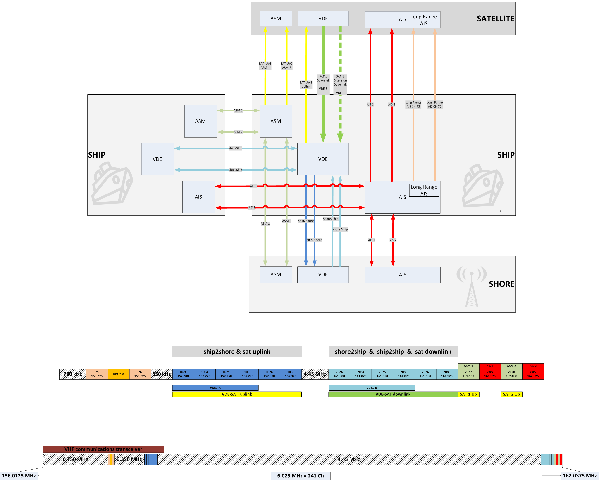

# Technical Characteristics
A general overview of the technical aspects of VDES is provided in IALA Guideline 1117.  This section provides more detailed technical characteristics. 

## Shipborne VDES Receivers are Protected
As in AIS, shipborne VDES receivers are on the upper legs of RR Appendix 18, 4.6 MHz above the lower legs, which facilitates protection by filtering from receiver blocking by ships VHF radios.

## SAT Downlink
The satellite downlink complies with the power flux-density (PFD) mask described in Table A4-1 to minimize interference to terrestrial services and to maximize reception by ship VDES stations.

## VDES1 Uses Both Legs of the Duplex Channels
Channel capacity is utilized for the duplex channels in VDE1 by using the lower legs (VDE1-A) for ship-to-shore and the upper legs (VDE1-B) for shore-to-ship and ship-to-ship digital messaging.

{\*@tbl:RR_Appendix_18_channels_for_VDES_applications} describes the RR Appendix 18 channels used for the various applications of VDES.

RR Appendix 18 channel number | Transmitting frequency (MHz) - Ship-to-shore, long range AIS, ship-to-satellite | Transmitting frequency (MHz) - Shore-to-ship, ship-to-ship, satellite-to-ship
--- | --- | ---
AIS 1 | 161.975 | 161.975
AIS 2	| 162.025	| 162.025
75 (long range AIS) |	156.775 (ships are Tx only) |	N/A
76 (long range AIS)	| 156.825 (ships are Tx only)	| N/A
2027 (ASM 1) | 161.950 | 161.950
2028 (ASM 2) | 162.000 | 162.000
24/84/25/85 (VDE 1) | 100 kHz channel, lower legs (VDE 1 A) merged, ship-to-shore | 100 kHz channel, upper legs (VDE 1 B) merged, shore-to-ship, ship-to-ship 
24 | 157.200 (1024)	| 161.800 (2024)
84 | 157.225 (1084)	| 161.825 (2084)
25 | 157.250 (1025)	| 161.850 (2025)
85 | 157.275 (1085)	| 161.875 (2085)
24/84/25/85/26/86 | 150 kHz channel, ship-to-satellite | 150 kHz channel, satellite-to-ship
24 - 85 | see above	| see above
26 | 157.300 (1026)	| 161.900 (2026)
86 | 157.325 (1086)	| 161.925 (2086)

Table: RR Appendix 18 channels for VHF data exchange systems applications: Automatic identification system, application specific messages, VHF data exchange {#tbl:RR_Appendix_18_channels_for_VDES_applications}

## VHF Data Exchange System Functions and Frequency Usage Engineer's Perspective
The VDES functions and frequency usage from an engineer’s perspective are illustrated pictorially in {\*@fig:VHF_data_exchange_system_functions_and_frequency_usage}.

{#fig:VHF_data_exchange_system_functions_and_frequency_usage}
